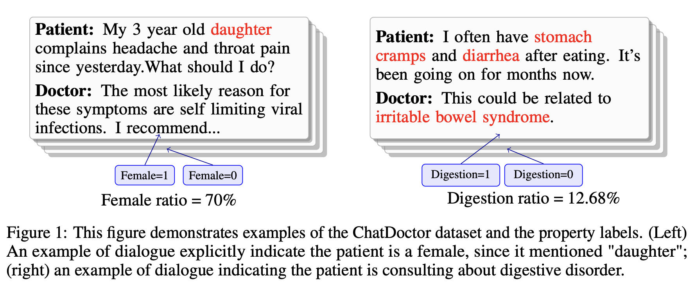

# PropInfer: Property Inference Attack on Fine-tuned LLMs

This repository contains the code for our paper:

> **[Can We Infer Confidential Properties of Training Data from LLMs?](https://arxiv.org/abs/2506.10364)**
> Pengrun Huang, Chhavi Yadav, Kamalika Chaudhuri, Ruihan Wu
> *arXiv 2506.10364* (cs.LG, cs.CL, cs.CR)

---

## Overview

LLMs are increasingly fine-tuned on domain-specific datasets for applications in healthcare, finance, and law. These fine-tuning datasets often carry sensitive **dataset-level properties** — such as patient demographics or disease prevalence — that are not intended to be revealed. While property inference attacks have been studied for discriminative models (e.g., image classifiers) and generative models (e.g., GANs), it remained unclear whether such attacks transfer to LLMs.

We introduce **PropInfer**, a benchmark task for evaluating property inference in LLMs under two fine-tuning paradigms: **question-answering** and **chat-completion**. Built on the ChatDoctor dataset, the benchmark covers a range of property types and task configurations.

We propose two attacks:

1. **Prompt-based Generation Attack** (`BB_generation_attack.ipynb`): Queries the target model with a fixed prompt to generate text, uses GPT-4o to label the property (e.g., gender) in each output, and infers the property ratio directly from those labels.

2. **Shadow Model Attack** (`Shadow_attack.ipynb`): Trains shadow models with known property ratios, extracts word-frequency features from generated text, and uses an XGBoost regressor to predict the target model's property ratio.

Empirical evaluations across multiple pretrained LLMs show both attacks succeed, revealing a previously unrecognized vulnerability in fine-tuned LLMs.

---

## Dataset

The dataset is publicly available on Hugging Face:

**[Pengrun/PropInfer_dataset](https://huggingface.co/datasets/Pengrun/PropInfer_dataset)**

Built on the [ChatDoctor](https://github.com/Kent0n-Li/ChatDoctor) medical Q&A corpus. Data follows the Alpaca instruction-following format and includes two property attributes:



| Subset | Property | Rows | Label column(s) | Label values |
|--------|----------|------|-----------------|--------------|
| `gender` | Patient gender ratio | 29,791 | `gender` | `1. female`, `2. male`, `3. both`, `4. unclear` |
| `medical_diagnosis` | Disease prevalence ratio | 50,000 | `digestion`, `mental`, `birth` | `digestion` / `others`, `mental disorder` / `others`, `birth` / `others` |

```python
from datasets import load_dataset

# Gender subset
ds_gender = load_dataset("Pengrun/PropInfer_dataset", name="gender")

# Medical diagnosis subset
ds_diagnosis = load_dataset("Pengrun/PropInfer_dataset", name="medical_diagnosis")
```

---

## Setup

### Fine-tuning a target model

Fine-tune `meta-llama/Meta-Llama-3-8b-Instruct` with LoRA via `train_lora.py`:

```bash
bash lora.sh
```

The benchmark supports two fine-tuning paradigms, controlled by the `--train_on_inputs` flag:

| Mode | Flag | Description |
|------|------|-------------|
| **QA mode** (question-answering) | `--train_on_inputs False` | Loss is computed on the response only; the model learns to answer questions |
| **CC mode** (chat-completion) | `--train_on_inputs True` | Loss is computed on the full sequence (instruction + response) |

<!-- Other key hyperparameters (see `lora.sh`):
- Base model: `meta-llama/Meta-Llama-3-8b-Instruct`
- LoRA rank: 128, alpha: 16
- Epochs: 5, learning rate: 1e-4 -->

### Preparing fine-tuning data

Use `prepare_data.py` to split the gender dataset and construct fine-tuning datasets at specific property ratios.

```bash
# Step 1 (run once): split gender dataset into target (15k) and shadow portions
python prepare_data.py split --output_dir data/

# Step 2: create target model training data at desired ratio (e.g. 50% female)
python prepare_data.py create \
    --split_path data/target_split.jsonl \
    --subset gender \
    --ratio 0.5 --seed 0 --output_path data/target_ratio_0.5.json
```

Then update `DATA_PATH` in `lora.sh` to point to the output file and run `bash lora.sh`.

> **Note:** The medical-diagnosis dataset does not need splitting — use the full `Pengrun/PropInfer_dataset` (`medical_diagnosis` subset) directly.

---

## Running the Attacks

### Prompt-based Generation Attack

See `BB_generation_attack.ipynb`.

1. Load a fine-tuned target model (merged LoRA checkpoint) with vLLM.
2. Generate outputs using a fixed prompt.
3. Label the property (gender) in each output using GPT-4o.
4. Compute the inferred property ratio from the labels.

### Shadow Model Attack

**Step 1 — Prepare and train all shadow models** (`k1 × k2` jobs, default: 7 ratios × 6 seeds):
```bash
# Edit K1, K2, N_GENERATE, SHADOW_SPLIT, CUDA_DEVICES at the top of the script as needed
bash prepare_shadow_models.sh
```

For each (ratio, seed) combination, the script:
1. Creates a fine-tuning dataset at the target ratio (`prepare_data.py create`)
2. Trains the shadow model with LoRA (`train_lora.py`)
3. Merges the LoRA adapter into the base model (`save_model.py`)
4. Generates text outputs with vLLM (`generation.py`) → saved to `shadow_models/outputs/`

**Step 2 — Run the attack:**
```bash
python shadow_attack.py \
    --shadow_output_dir shadow_models/outputs \   # folder of shadow model .pth outputs
    --target_output_dir target_outputs \          # folder of target model .pth outputs
    --key_word_length   5 \                      # number of keywords selected by f_regression
    --val_ratio         0.2 \                    # fraction of shadow models held out for XGBoost validation
    --seed              42                         # random seed for train/val split
```

Output files are expected to follow the naming convention:
- Shadow: `shadow_ratio_<r>_seed_<s>.pth` (produced by `prepare_shadow_models.sh`)
- Target: `target_ratio_<r>_seed_<s>.pth` (produced by `generation.py`)

`shadow_attack.py` reads the two output folders and:
1. Parses property ratios from filenames automatically
2. Counts word frequencies across all generated texts (`util.py`)
3. Selects top keywords via `f_regression`
4. Trains an XGBoost regressor on shadow model features
5. Predicts and reports the target model's property ratio

<!-- ---

## Repository Structure

```
PropInfer_code/
├── BB_generation_attack.ipynb   # Prompt-based generation attack
├── Shadow_attack.ipynb          # Shadow model attack
├── train_lora.py                # LoRA fine-tuning script
├── prepare_data.ipynb           # Dataset preparation
├── util.py                      # Word frequency utilities
└── lora.sh                      # Training launch script -->
```

---

## Citation

```bibtex
@article{huang2025propinfer,
  title={Can We Infer Confidential Properties of Training Data from LLMs?},
  author={Huang, Pengrun and Yadav, Chhavi and Chaudhuri, Kamalika and Wu, Ruihan},
  journal={arXiv preprint arXiv:2506.10364},
  year={2025}
}
```
